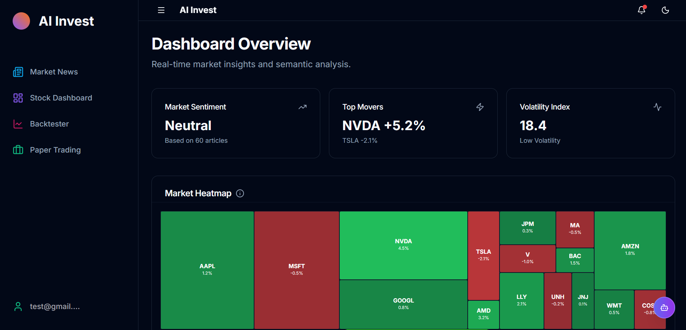
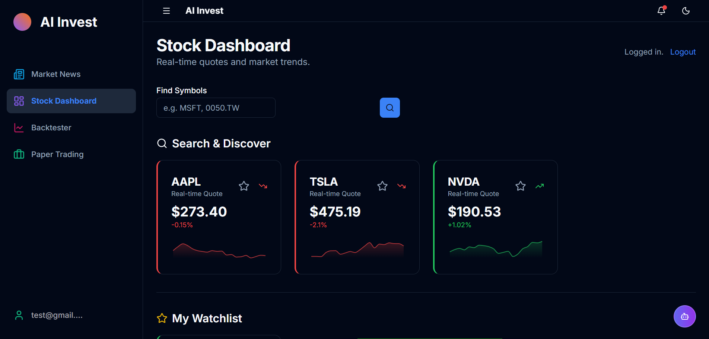
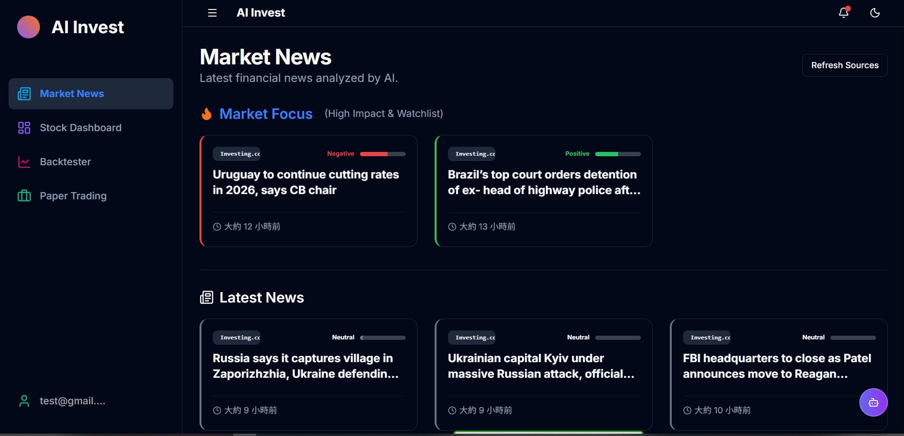
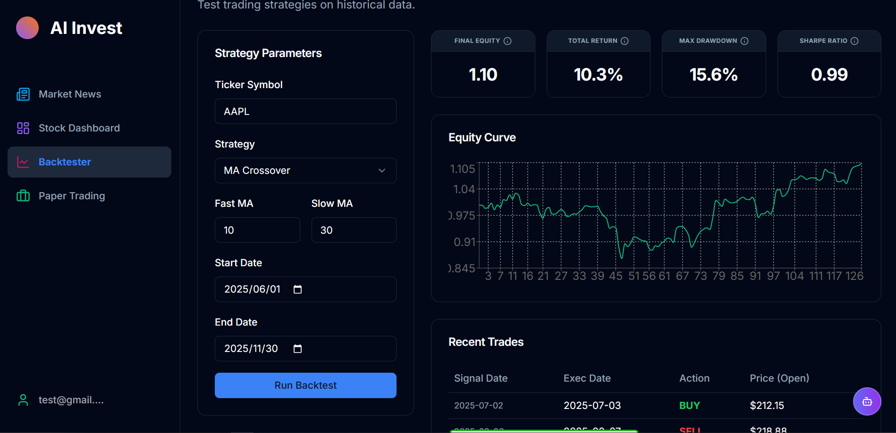

# AI Invest Platform

**AI Invest Platform** is a comprehensive financial analysis tool that combines **Artificial Intelligence (NLP)** with **Real-time Market Data** to help investors make smarter decisions.

It integrates news sentiment analysis, technical indicators, strategy backtesting, and paper trading into a single, modern web interface.

## 🚀 Key Features

*   **📰 AI-Powered News Feed**: 
    *   Aggregates market news from top sources (TechCrunch, Investing.com, CNA, Google News).
    *   Uses **NLP (Natural Language Processing)** to analyze sentiment (Bullish/Bearish) automatically.
    *   Intelligent filtering to remove generic content and deduplicate articles.
*   **asd Stocks Dashboard**:
    *   Real-time price tracking for US (e.g., `NVDA`, `TSLA`) and TW (e.g., `2330.TW`) stocks.
    *   Interactive charts with technical indicators (RSI, MACD, SMA).
    *   **Market Heatmap** to visualize sector performance at a glance.
*   **📈 Strategy Backtester**:
    *   Test trading strategies (e.g., SMA Crossover, RSI Reversal) on historical data.
    *   Visualize Equity Curves, Win Rates, and Drawdowns.
*   **💰 Paper Trading (Simulation)**:
    *   Practice trading with virtual funds without risking real money.
    *   Real-time P&L tracking and portfolio management.
*   **🤖 AI Assistant**:
    *   Built-in chatbot context-aware of market data to answer financial questions.

## 🛠️ Tech Stack

### Frontend
*   **Framework**: [Next.js 14](https://nextjs.org/) (App Router)
*   **Language**: TypeScript
*   **UI Library**: [Shadcn/UI](https://ui.shadcn.com/) + Tailwind CSS
*   **Charts**: Recharts
*   **State Management**: React Context + Hooks

### Backend
*   **Framework**: [FastAPI](https://fastapi.tiangolo.com/) (Python)
*   **Database**: SQLite (Dev) / PostgreSQL (Prod) via SQLAlchemy (Async)
*   **Crawler**: Playwright + Beautiful Soup
*   **Task Queue**: Celery + Redis (for background crawling)
*   **Data Sources**: `yfinance`, RSS Feeds

---

## 🌍 Live Demo
*The system is currently deployed and accessible via:*
- **Dashboard**: [\[Link to Vercel Deployment\]](https://ai-invest-platform.vercel.app/)
- **API Docs**: [\[Link to Render Backend\]](https://ai-invest-platform.onrender.com/docs)

*(Note: If running locally, please see the Developer Guide below)*

---

## 🏁 Getting Started

### Prerequisites
*   Python 3.9+
*   Node.js 18+
*   (Optional) Docker & Docker Compose

### Installation (Local Development)

1.  **Clone the repository**
    ```bash
    git clone https://github.com/yourusername/ai-invest-platform.git
    cd ai-invest-platform
    ```

2.  **Setup Backend**
    ```bash
    cd backend
    python -m venv venv
    # Windows
    .\venv\Scripts\activate
    # Mac/Linux
    # source venv/bin/activate
    
    pip install -r requirements.txt
    playwright install chromium
    
    # Run Server
    uvicorn app.main:app --reload --port 8000
    ```

3.  **Setup Frontend**
    ```bash
    cd frontend
    npm install
    npm run dev
    ```

4.  **Access the App**
    *   Frontend: `http://localhost:3000`
    *   Backend API Docs: `http://localhost:8000/docs`

### Docker Deployment

To run the full stack (Frontend, Backend, DB, Redis, Worker) with one command:

```bash
docker-compose up --build
```

## 📸 Screenshots

| Dashboard | Stock Analysis |
|-----------|----------------|
|  |  |

| News Feed | Backtester |
|-----------|------------|
|  |  |

## 📄 License

This project is licensed under the MIT License - see the [LICENSE](LICENSE) file for details.
